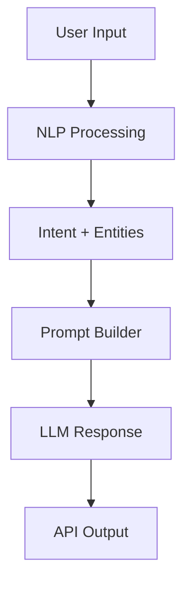

# 🌍 Aiman Travel Guide Project

```{=html}
<p align="center">
```
``{=html}
``{=html}
``{=html}
``{=html}
```{=html}
</p>
```
```{=html}
<p align="center">
```
`<b>`{=html}An intelligent AI-powered travel assistant that understands
natural language and helps plan trips effortlessly.`</b>`{=html}
```{=html}
</p>
```

------------------------------------------------------------------------

## 👤 Author

**Aiman Iqbal**

------------------------------------------------------------------------

## 🎥 Demo Preview

```{=html}
<p align="center">
```
``{=html}
```{=html}
</p>
```

------------------------------------------------------------------------

## 📸 Screenshots

### 💬 Chat Interface


### 🧠 NLP Processing


### ⚡ API Response


------------------------------------------------------------------------

## 🚀 Features

-   🧠 Intelligent intent recognition (flight, hotel, travel)
-   📍 Location & entity extraction (NER)
-   🤖 AI-generated smart responses (LLM)
-   🌐 Flask-based API backend
-   ⚡ Modular and scalable architecture

------------------------------------------------------------------------

## 🏗️ Project Structure

    project/
    │── nlp/           # NLP pipeline (intent, NER, preprocessing)
    │── llm/           # AI model and response generation
    │── LLM_API/       # Flask API backend
    │── training_data/ # Model training data

------------------------------------------------------------------------

## ⚙️ Tech Stack

  Technology     Purpose
  -------------- -----------------
  Python         Core language
  Flask          API backend
  Scikit-learn   ML models
  NLP            Text processing
  LLM            AI responses

------------------------------------------------------------------------

## ▶️ Getting Started

### 1️⃣ Install Dependencies

``` bash
pip install flask scikit-learn nltk
```

### 2️⃣ Run the Project

``` bash
python app.py
```

### 3️⃣ Test API

``` json
POST /chat
{
  "message": "Find hotels in Paris"
}
```

------------------------------------------------------------------------

## 🔄 Workflow



------------------------------------------------------------------------

## 📌 Future Improvements

-   🌐 Real-time travel APIs integration
-   💬 Chat history memory
-   📊 Better ML models (BERT, Transformers)
-   🚀 Cloud deployment

------------------------------------------------------------------------

## ⭐ Support

If you like this project: - ⭐ Star the repo - 🍴 Fork it - 🛠️
Contribute

------------------------------------------------------------------------

## 📜 License

This project is for educational purposes.

------------------------------------------------------------------------

```{=html}
<p align="center">
```
Made with ❤️ by `<b>`{=html}Aiman Iqbal`</b>`{=html}
```{=html}
</p>
```
